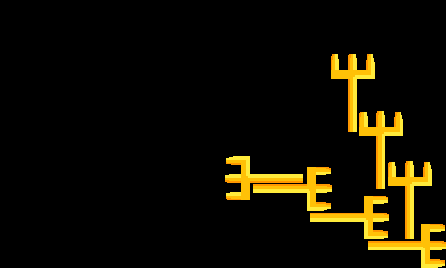

## Неудачные идеи

Пихание объектов на полотно, начиная с угла
пример результата программы: 


 
 Код:


```
 if x_or_y > 0:
    if x_or_y == 1:  # if x_or_y still not constant
        x_or_y = -1  # the next shift in x
    if y - move_y >= 0:  # if we can move image on y without going beyond
        y -= move_y  # moving
    else:
        x_or_y = -2  # Now we can't move on y

elif x_or_y < 0:
    if x_or_y == -1:  # if x_or_y still not constant
        x_or_y = 1  # the next shift in y
    if x - move_x >= 0:  # if we can move image on y without going beyond
        x -= move_x  # moving
    else:
        x_or_y = 2  # Now we can't move on x
```
