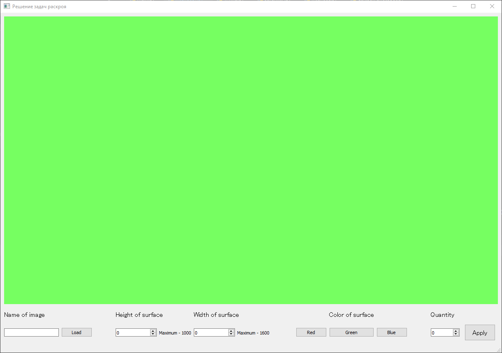
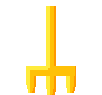
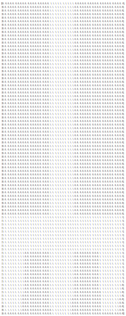
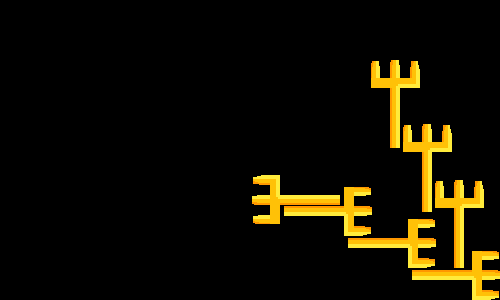
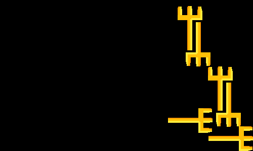

**Решение задачи раскроя программным методом**
====

# Этапы выполнения

## 1) Создание интерфейса с помощью Qt creator



> Перед вами стартовое окно. При открытии программы пользователь видит следующие виджеты:
> 
- Name of image:	поле для ввода и кнопка Load. Сюда пользователь вводит имя файла и	путь к нему и нажимает кнопку для загрузки изображения.
- High of surface и Width of surface: два поля для ввода размеров основной поверхности
- Color of surface: Кнопки, меняющие цвет основной поверхности (изначально – «Green»)
- Quantity:	поле для ввода числа: количества дублирований заданного изображения	на основной поверхности

## 2) Загрузка изображения. Подсчет площади фигуры на изображении в пикселях

> В представленном фрагменте кода с помощью библиотеки Pillow идет подсчет количества существующих пикселей. Количество пикселей и есть площадь фигуры.
> 

```python
def crop(self):
    image_square = 0
    lower_right_coord = [None, None]  # lower right - L
    upper_left_coord = [None, None]  # upper left - U:
    # _  _  U  _  _  1  _  _  _  _  _
    # _  _  _  _  _  1  _  _  _  _  _
    # _  _  1  2  3  4  5  6  7  _  _
    # _  _  1  _  _  2  _  _  3  _  _
    # _  _  1  _  _  2  _  _  L  _  _

    for i in range(self.width):
        for j in range(self.height):
            r, g, b, a = self.pixels[i, j]
            if a != 0:
                # -----------------------------
                image_square += 1
                # -----------------------------
                if upper_left_coord[0] is None:
                    upper_left_coord[0] = i
                if upper_left_coord[1] is None:
                    upper_left_coord[1] = j

                if lower_right_coord[0] is None:
                    lower_right_coord[0] = i
                if lower_right_coord[1] is None:
                    lower_right_coord[1] = j
                else:
                    if upper_left_coord[0] > i:
                        upper_left_coord = i
                    if upper_left_coord[1] > j:
                        upper_left_coord[1] = j

                    if lower_right_coord[0] < i:
                        lower_right_coord[0] = i
                    if lower_right_coord[1] < j:
                        lower_right_coord[1] = j
```

## 3) Подсчет максимального количества фигур, которые можно разместить на основной поверхности

> Для расчёта используется формула:
> 

> $$
> \frac{Sповерхности}{S фигуры}
> $$
> 

## 4) Создание матриц для основной поверхности и для фигуры

> Матрицы создаются по принципу:
> 
1. Инициализация списка, включающего в себя вложенные	списки, количество которых = высоте поверхности или фигуры. В каждом вложенном списке содержатся «0»,	количество которых = ширине поверхности или фигуры. Так получается пока пустая	матрица.
2. Замена «0» на «1» в местах, где альфа канал пикселя > 0. По принципу, схожему с	тем, что использовался для подсчета	площади.

```python
def create_matrix(self):
    # check pixels, matrix
    for i in range(self.height):
        for j in range(self.width):
            r, g, b, a = self.pixels[j, i]
            if a != 0:  # if pix != None
                self.matrix[i][j] = 1  # замена 0 на 1
```

> Перед вами фрагмент кода, отвечающий за заполнение единицами матрицы фигуры.
> 

> Если мы загрузим в программу следующее изображение:
> 



> То его матрица будет выглядеть так:
> 



## 5) Размещение фигуры на основной поверхности с использованием циклов

> В цикле для размещения каждый раз заданная фигура должна получать две характеристики: угол поворота и кортеж с координатами.
> 

> Наиболее простым в реализации способом будет задание этих параметров с помощью методов рандома. После получения параметров в цикле, матрица фигуры меняется (если угол поворота неравен 0) и «накладывается» на основну. В процессе наложения «1» из матрицы фигуры копируются в матрицу основной поверхности с учетом заданных координат.
> 

> Ниже представлен фрагмент кода, в котором идет процесс наложения. Стоит также отметить, что автор предусмотрел возможность наложения фигур друг на друга, поэтому при обнаружении таковых цикл переноса матрицы останавливается и начинается заново уже с другими параметрами поворота и координат.
> 

```python
def add_images(self, data):
    print(data)
    overlaying_image = Image.open('rezs/ready_image.png')
    x, y, over_matrix = data
    ov_im_width, ov_im_height = overlaying_image.size
    good_height = False
    im_qual = 0
    fail_count = 0

    while not good_height and y >= 0:
        matrix_copy = copy.deepcopy(self.main_matrix)
        overlay = False
        for i in range(self.main_height):
            for j in range(self.main_width):
                # ENTER
                small_i = i - y
                small_j = j - x
                if ov_im_height > small_i >= 0 and ov_im_width > small_j >= 0:
                    if not self.main_matrix[i][j] == over_matrix[small_i][small_j] == 1:
                        self.main_matrix[i][j] = over_matrix[small_i][small_j]

                    else:
                        overlay = True
        if not overlay:
            self.main_image.paste(overlaying_image, (x, y), overlaying_image)
            good_height = True
            im_qual += 1
            # fail_count = 0
        else:
            fail_count += 1

            self.main_matrix = matrix_copy
            y -= 10

    print('DONE!')
```

> По завершению работы цикла программа выводит получившееся изображение, в котором количество фигур = максимально допустимому, определенном в начале:
> 

#картинка

# **Вывод**

> В работе автором была реализована программа, решающая задачу раскроя с произвольными фигурами, а так же реализована возможность пользователя самостоятельно задавать основные параметры для создания необходимого раскроя.
#
# Неудачные идеи

Пихание объектов на полотно, начиная с угла
пример результата программы: 


 
 ### Код:
```
 if x_or_y > 0:
    if x_or_y == 1:  # if x_or_y still not constant
        x_or_y = -1  # the next shift in x
    if y - move_y >= 0:  # if we can move image on y without going beyond
        y -= move_y  # moving
    else:
        x_or_y = -2  # Now we can't move on y

elif x_or_y < 0:
    if x_or_y == -1:  # if x_or_y still not constant
        x_or_y = 1  # the next shift in y
    if x - move_x >= 0:  # if we can move image on y without going beyond
        x -= move_x  # moving
    else:
        x_or_y = 2  # Now we can't move on x
```

# Заметки
