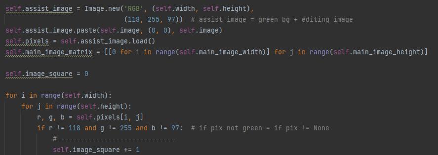
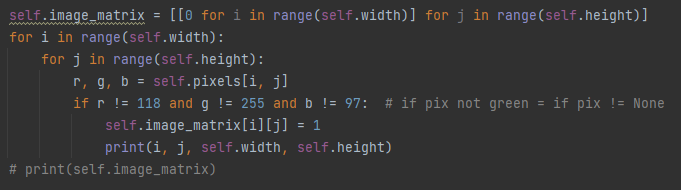

**Решение задачи раскроя программным методом**
====

# Этапы выполнения

## 1) Создание интерфейса с помощью Qt creator


> Перед вами стартовое окно. При открытии программы пользователь видит следующие виджеты:
> 
- Name of image:	поле для ввода и кнопка Load. Сюда пользователь вводит имя файла и	путь к нему и нажимает кнопку для загрузки изображения.
- High of surface и Width of surface: два поля для ввода размеров основной поверхности
- Color of surface: Кнопки, меняющие цвет основной поверхности (изначально – «Green»)
- Quantity:	поле для ввода числа: количества дублирований заданного изображения	на основной поверхности

## 2) Загрузка изображения. Подсчет площади фигуры на изображении в пикселях

> В представленном фрагменте кода идет наложение фигуры на фон определенного цвета с помощью библиотеки Pillow. Далее идет подсчет количества пикселей, чей цвет не совпадает с фоновым. Количество пикселей и есть площадь фигуры.
> 



## 3) Подсчет максимального количества фигур, которые можно разместить на основной поверхности

> Для расчёта используется формула:
> 

> $$
> \frac{Sповерхности}{S фигуры}
> $$
> 

## 4) Создание матриц для основной поверхности и для фигуры

> Матрицы создаются по принципу:
> 
1. Инициализация списка, включающего в себя вложенные	списки, количество которых = высоте поверхности или фигуры. В каждом вложенном списке содержатся «0»,	количество которых = ширине поверхности или фигуры. Так получается пока пустая	матрица.
2. Замена «0» на «1» в местах, где альфа канал пикселя > 0. По принципу, схожему с	тем, что использовался для подсчета	площади.



> Перед вами фрагмент кода, отвечающий за заполнение единицами матрицы фигуры.
> 

> Если мы загрузим в программу следующее изображение:
> 


> То его матрица будет выглядеть так:
> 


## 5) Размещение фигуры на основной поверхности с использованием циклов

> В цикле для размещения каждый раз заданная фигура должна получать две характеристики: угол поворота и кортеж с координатами.
> 

> Наиболее простым в реализации способом будет задание этих параметров с помощью методов рандома. После получения параметров в цикле, матрица фигуры меняется (если угол поворота неравен 0) и «накладывается» на основну. В процессе наложения «1» из матрицы фигуры копируются в матрицу основной поверхности с учетом заданных координат.
> 

> Ниже представлен фрагмент кода, в котором идет процесс наложения. Стоит также отметить, что автор предусмотрел возможность наложения фигур, поэтому при обнаружении таковых цикл переноса матрицы останавливается и начинается заново уже с другими параметрами поворота и координат.
> 


> По завершению работы цикла программа выводит получившееся изображение, в котором количество фигур = максимально допустимому, определенном в начале:
> 

#картинка

# **Вывод**

> В работе автором была реализована программа, решающая задачу раскроя с произвольными фигурами, а так же реализована возможность пользователя самостоятельно задавать основные параметры для создания необходимого раскроя.
#
# Неудачные идеи

Пихание объектов на полотно, начиная с угла
пример результата программы: 


 
 ### Код:
```
 if x_or_y > 0:
    if x_or_y == 1:  # if x_or_y still not constant
        x_or_y = -1  # the next shift in x
    if y - move_y >= 0:  # if we can move image on y without going beyond
        y -= move_y  # moving
    else:
        x_or_y = -2  # Now we can't move on y

elif x_or_y < 0:
    if x_or_y == -1:  # if x_or_y still not constant
        x_or_y = 1  # the next shift in y
    if x - move_x >= 0:  # if we can move image on y without going beyond
        x -= move_x  # moving
    else:
        x_or_y = 2  # Now we can't move on x
```

# Заметки
